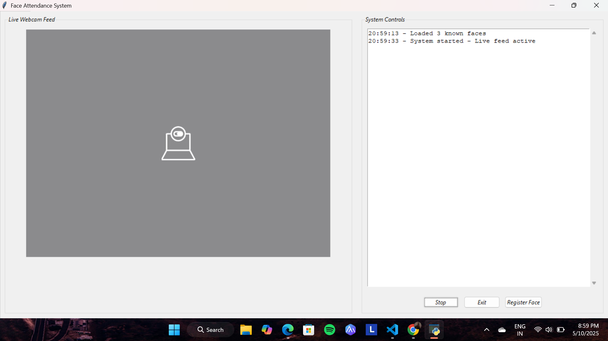

# Face Attendance System with GUI

 *Add demo screenshot/video here*

A real-time facial recognition attendance system with enhanced GUI controls, offering smooth performance and intuitive face management.

## Key Features ✨

- **GUI-Based Face Registration**  
  Register new faces directly through the interface - no manual file management required
- **High-FPS Webcam Feed**  
  Multithreaded processing delivers smooth 30+ FPS live video
- **Smart Attendance Logging**  
  Automatic CSV entries with timestamp & date (Documents/attendance.csv)
- **Real-Time Face Annotations**  
  Live bounding boxes and name tags for recognized faces
- **Duplicate Prevention**  
  Blocks same-day duplicate entries and duplicate name registrations
- **Face Validation System**  
  Auto-detects invalid images (multiple faces/no faces) during registration
- **Responsive Interface**  
  Threaded design keeps GUI responsive during heavy processing
- **System Console**  
  Scrollable log panel with timestamped status updates and errors

## Technical Stack 💻

**Core Technologies**  
⌙ Python 3.11+  
⌙ OpenCV (cv2) - Real-time video processing  
⌙ face_recognition - Face detection & recognition  
⌙ Tkinter - GUI interface  

**Supporting Libraries**  
⌙ Pillow (PIL) - Image processing  
⌙ NumPy - Array operations  
⌙ Threading - Concurrent processing  

## Installation ⚙️

1. **Prerequisites**:
   - Webcam
   - Python 3.11+ 
   - Windows/macOS/Linux

2. **Install dependencies**:
   ```bash
   pip install opencv-python numpy face-recognition pillow